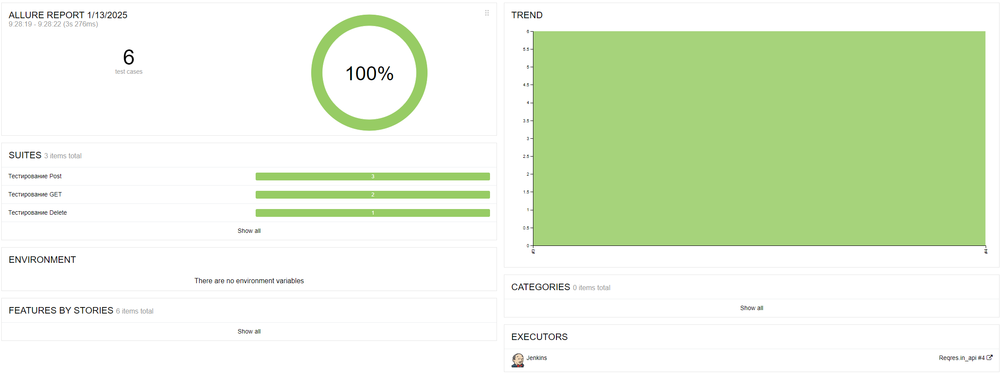

# Проверка API для сайта [Reqres](https://reqres.in/)

## Содержание

* <a href="#tools">Инструменты</a>
* <a href="#cases">Тестовое покрытие</a>
* <a href="#launch">Запуск</a>
* <a href="#allure">Отчет в Allure</a>
* <a href="#allureTestOps">Интеграция с Allure TestOps</a>
* <a href="#telegramBot">Бот в Telegram</a>
* <a href="#video">Видео прохождения тестов</a>

---
<a id="tools"></a>

## <a name="Инструменты">**Инструменты**</a>

<p align="center">
<a href="https://www.jetbrains.com/idea/"></a>
<a href="https://www.jenkins.io/"></a>
<a href="https://github.com/"></a>  
<a href="https://www.java.com/"></a>
<a href="https://gradle.org/"></a>  
<a href="https://junit.org/junit5/"></a>
<a href="https://selenide.org/"></a>
<a href="https://rest-assured.io/">  </a>
<a href="https://github.com/allure-framework/"></a>
<a href="https://telegram.org/"></a>
</p>

---

<a id="cases"></a>

## <a name="Тестовое покрытие">**Тестовое покрытие**</a>

### Авторизация пользователя

✅ Успешная авторизация пользователя<br>
✅ Невозможно авторизоваться без пароля<br>
✅ Пользователь не найден<br>

### Получение, редактирование, удаление пользователя

✅ Успешное получение одного пользователя <br>
✅ Проверка Заголовка при переходе на статью <br>
✅ Пользователь остутствует <br>
✅ Успешное удаление пользователя<br>

<a id="localrun"></a>

<a id="launch"></a>

## <a name="Запуск">**Запуск**</a>

```bash
 gradle clean test
```

<a id="allure"></a>

## <a name="Отчет в Allure">**Отчет в Allure**</a>

После выполнения тестов можно посмотреть отчет
в [Allure](https://jenkins.autotests.cloud/job/Reqres.in_api/8/allure/)

### На скриншоте один из результатов выполнения тестов:



---

<a id="allureTestOps"></a>

## <a name="Интеграция с Allure TestOps">**Интеграция с Allure TestOps**</a>

Есть интеграция с [Allure TestOps](https://allure.autotests.cloud/project/4547/dashboards), где можно посмотреть еще
ручные тесты


---

<a id="telegramBot"></a>

## <a name="Бот в Telegram">**Бот в Telegram**</a>

После выполнения отчета результат так же предоставит бот в Telegram:
<p align="center">
    
</p>

---
